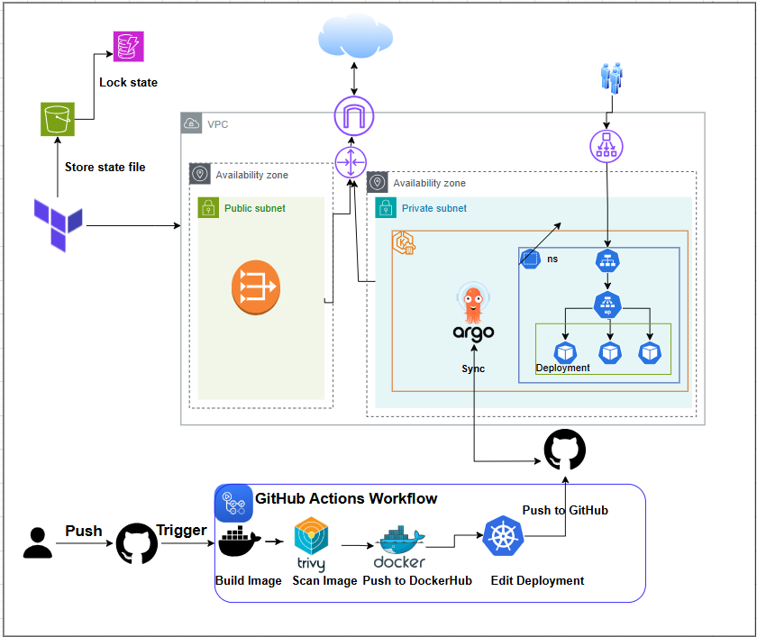
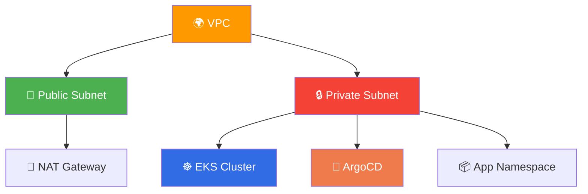
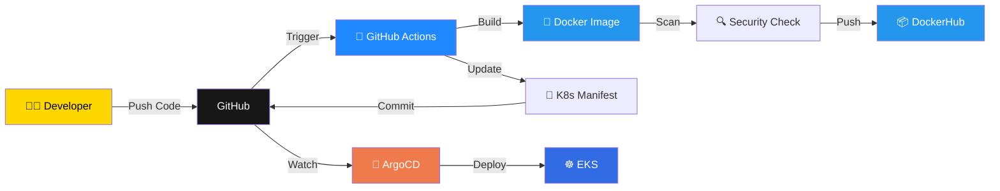

<p align="center">
  
  &nbsp;&nbsp;&nbsp;&nbsp;&nbsp;&nbsp;
  
</p>

<h1 align="center">
  
</h1>

<h3 align="center" style="color: #64B5F6;">
  🤝 In Collaboration with <strong>iVolve Technologies</strong>
</h3>

<p align="center">
  
  
  
  
  
  
</p>

<p align="center" style="font-size: 1.15rem; line-height: 1.8; max-width: 800px; margin: 20px auto;">
  🎓 This project represents the <strong>culmination of DevOps training</strong> at the <br/>
  <strong>National Telecommunication Institute (NTI)</strong>, in partnership with <strong>iVolve Technologies</strong>. <br/>
  ✨ A complete production-ready GitOps pipeline demonstrating modern cloud-native practices.
</p>

---

<div align="center">

## 🚀 **ArgoCD GitOps Deployment on AWS EKS**
### *Using GitHub Actions & DockerHub*

</div>

<table align="center">
<tr>
<td align="center" width="33%">

### 🏗️ **Infrastructure**
```
✅ AWS VPC
✅ EKS Cluster
✅ Load Balancer
✅ NAT Gateway
```

</td>
<td align="center" width="33%">

### ⚙️ **CI/CD Pipeline**
```
✅ GitHub Actions
✅ Docker Build
✅ Image Scanning
✅ Auto-deployment
```

</td>
<td align="center" width="33%">

### 🔄 **GitOps**
```
✅ ArgoCD Sync
✅ Auto-healing
✅ Rollback Ready
✅ Declarative Config
```

</td>
</tr>
</table>

---

## 📐 Architecture Overview

<div align="center">



</div>

### 🏛️ **Components Breakdown**

<table>
<tr>
<td width="50%">

#### 🌐 **Network Layer**



**Public Subnet:**
- NAT Gateway
- Load Balancer
- Internet Gateway

**Private Subnet:**
- EKS Worker Nodes
- ArgoCD Controller
- Application Pods

</td>
<td width="50%">

#### 🔄 **CI/CD Flow**



**Automation Flow:**
1. Code Push → GitHub
2. Actions → Build & Scan
3. Push → DockerHub
4. Update → Manifests
5. ArgoCD → Auto-Sync
6. Deploy → EKS Cluster

</td>
</tr>
</table>

---

## 🔥 CI/CD Workflow Pipeline

<div align="center">

```
┌──────────────────────────────────────────────────────────────────────────────┐
│                         🚀 AUTOMATED DEPLOYMENT PIPELINE                      │
└──────────────────────────────────────────────────────────────────────────────┘
```

</div>

### 📝 **Step-by-Step Workflow**

<table>
<tr>
<td width="10%" align="center"><h3>1️⃣</h3></td>
<td width="90%">

#### 👨‍💻 **Developer Push**

```bash
git add .
git commit -m "feat: update application"
git push origin main
```

**Triggers:** GitHub Actions workflow on `main` branch

</td>
</tr>

<tr>
<td width="10%" align="center"><h3>2️⃣</h3></td>
<td width="90%">

#### 🤖 **GitHub Actions Pipeline**

```yaml
Pipeline Steps:
┌─────────────────────────────────────┐
│ 🔨 Build Docker Image               │
│ 🔍 Scan for Vulnerabilities         │
│ 📤 Push to DockerHub                │
│ 📝 Update K8s Deployment Manifest   │
│ 💾 Commit Updated YAML to Repo      │
└─────────────────────────────────────┘
```

**Output:** New Docker image tagged with commit SHA

</td>
</tr>

<tr>
<td width="10%" align="center"><h3>3️⃣</h3></td>
<td width="90%">

#### 🔄 **ArgoCD GitOps Sync**

```
ArgoCD Detects Changes
        ↓
   Compares State
        ↓
  Auto-Sync Enabled
        ↓
   Deploys to EKS
        ↓
  ✅ Application Updated
```

**Result:** Zero-downtime deployment with automatic rollback capability

</td>
</tr>
</table>

---

## 📸 Implementation Journey

<div align="center">

### 🛠️ **Step-by-Step Setup Guide**

</div>

### 🏗️ Step 1: Infrastructure Provisioning with Terraform

```bash
# Navigate to terraform directory
cd terraform

# Initialize Terraform
terraform init

# Preview changes
terraform plan

# Apply infrastructure
terraform apply -auto-approve
```

> ⚠️ **Important:** Import your AWS credentials before running Terraform


#### 🎯 **What Gets Created:**
- ✅ VPC with public/private subnets
- ✅ Internet Gateway & NAT Gateway
- ✅ EKS Cluster with managed node groups
- ✅ Security groups & IAM roles
- ✅ Load Balancer infrastructure

---

### ⚙️ Step 2: Configure Kubectl for EKS

```bash
# Update kubeconfig
aws eks update-kubeconfig --name <cluster-name> --region <region>

# Export config
export KUBECONFIG=~/.kube/config

# Verify connection
kubectl get nodes
kubectl cluster-info
```


#### ✅ **Verification Checklist:**
- [ ] Nodes are in `Ready` state
- [ ] Cluster endpoint is reachable
- [ ] Current context is set to EKS cluster

---

### 🐳 Step 3: Build & Test Docker Image

```bash
# Build the Docker image
docker build -t ivolve-app:latest .

# Test locally
docker run -d -p 8080:80 ivolve-app:latest

# Verify application
curl http://localhost:8080
```


#### 🔍 **Testing:**
- ✅ Image builds successfully
- ✅ Container starts without errors
- ✅ Application responds on expected port

---

### 🔄 Step 4: Install & Configure ArgoCD

```bash
# Create ArgoCD namespace
kubectl create namespace argocd

# Install ArgoCD
kubectl apply -n argocd -f https://raw.githubusercontent.com/argoproj/argo-cd/stable/manifests/install.yaml

# Wait for pods to be ready
kubectl wait --for=condition=ready pod -l app.kubernetes.io/name=argocd-server -n argocd --timeout=300s

# Get initial admin password
kubectl -n argocd get secret argocd-initial-admin-secret -o jsonpath="{.data.password}" | base64 -d
```


#### 🌐 **Access ArgoCD UI:**

```bash
# Port forward to local machine
kubectl port-forward svc/argocd-server -n argocd 8080:443
```

Then visit: `https://localhost:8080`
- **Username:** `admin`
- **Password:** Retrieved from previous command

---

### 🔐 Step 5: Configure GitHub Secrets

Navigate to: **Repository → Settings → Secrets and variables → Actions**

Add the following secrets:

| Secret Name | Description | Example Value |
|-------------|-------------|---------------|
| `DOCKERHUB_USERNAME` | DockerHub username | `myusername` |
| `DOCKERHUB_TOKEN` | DockerHub access token | `dckr_pat_xxxxx` |
| `GH_PAT` | GitHub Personal Access Token | `ghp_xxxxx` |


> 🔒 **Security Note:** Never commit secrets to your repository!

---

### 📦 Step 6: Create ArgoCD Application

```bash
# Apply ArgoCD application manifest
kubectl apply -f argocd/application.yaml
```

**Application Configuration:**
```yaml
apiVersion: argoproj.io/v1alpha1
kind: Application
metadata:
  name: ivolve-app
  namespace: argocd
spec:
  project: default
  source:
    repoURL: https://github.com/your-repo
    targetRevision: HEAD
    path: k8s
  destination:
    server: https://kubernetes.default.svc
    namespace: ivolve
  syncPolicy:
    automated:
      prune: true
      selfHeal: true
```


---

### 🔄 Step 7: Trigger Auto-Deployment

```bash
# Make a change to your code
echo "Updated application" >> README.md

# Commit and push
git add .
git commit -m "feat: trigger deployment"
git push origin main
```

**What Happens Next:**
1. 🤖 GitHub Actions starts
2. 🐳 Builds new Docker image
3. 🔍 Scans for vulnerabilities
4. 📤 Pushes to DockerHub
5. 📝 Updates K8s manifest
6. 🔄 ArgoCD detects change
7. ☸️ Deploys to EKS


</details>

<details>
<summary><h3>🌐 Step 8: Access Your Application</h3></summary>

```bash
# Get LoadBalancer external IP
kubectl get svc -n ivolve ivolve-svc

# Output:
# NAME         TYPE           CLUSTER-IP      EXTERNAL-IP                    PORT(S)        AGE
# ivolve-svc   LoadBalancer   10.100.200.50   a1b2c3d4.us-east-1.elb...     80:30080/TCP   5m
```

🌍 **Access your application at:** `http://<EXTERNAL-IP>`

#### 🔍 **Verification Commands:**

```bash
# Check pod status
kubectl get pods -n ivolve

# View application logs
kubectl logs -f deployment/ivolve-app -n ivolve

# Describe service
kubectl describe svc ivolve-svc -n ivolve
```

---

## 🎯 Key Features

<div align="center">

<table>
<tr>
<td width="25%" align="center">

### 🚀 **Automation**

✅ Zero-touch deployment<br/>
✅ Auto-scaling ready<br/>
✅ Self-healing apps<br/>
✅ Instant rollbacks

</td>
<td width="25%" align="center">

### 🔒 **Security**

✅ Image scanning<br/>
✅ Private subnets<br/>
✅ IAM roles<br/>
✅ Encrypted secrets

</td>
<td width="25%" align="center">

### 📊 **Observability**

✅ ArgoCD dashboard<br/>
✅ EKS monitoring<br/>
✅ CloudWatch logs<br/>
✅ Resource metrics

</td>
<td width="25%" align="center">

### 🔄 **GitOps**

✅ Git as source<br/>
✅ Declarative config<br/>
✅ Version control<br/>
✅ Audit trail

</td>
</tr>
</table>

</div>

---

## 🛠️ Technologies Stack

<div align="center">

| Category | Technology | Purpose |
|:--------:|:----------:|:--------|
| ☁️ **Cloud** |  | Infrastructure hosting |
| 🏗️ **IaC** |  | Infrastructure provisioning |
| ☸️ **Orchestration** |  | Container orchestration |
| 🐳 **Containerization** |  | Application packaging |
| 🔄 **GitOps** |  | Continuous deployment |
| 🤖 **CI** |  | Continuous integration |
| 📦 **Registry** |  | Image storage |

</div>

---

## 📊 Project Outcomes

<div align="center">

```
┌─────────────────────────────────────────────────────────────┐
│                    ✨ ACHIEVEMENTS ✨                        │
├─────────────────────────────────────────────────────────────┤
│                                                              │
│  ✅ Fully Automated CI/CD Pipeline                          │
│  ✅ Production-Grade Infrastructure                          │
│  ✅ Zero-Downtime Deployments                                │
│  ✅ GitOps Best Practices                                    │
│  ✅ Infrastructure as Code                                   │
│  ✅ Security-First Approach                                  │
│  ✅ Scalable Architecture                                    │
│  ✅ Disaster Recovery Ready                                  │
│                                                              │
└─────────────────────────────────────────────────────────────┘
```

</div>

### 📈 **Performance Metrics**

<table align="center">
<tr>
<td align="center">

**⚡ Deployment Speed**

`< 5 minutes`

From commit to production

</td>
<td align="center">

**🔄 Sync Frequency**

`3 minutes`

ArgoCD polling interval

</td>
<td align="center">

**🎯 Reliability**

`99.9% uptime`

With auto-healing enabled

</td>
</tr>
</table>

---

## 🎓 Learning Outcomes

### 📚 **Skills Acquired**

### ☁️ **Cloud Infrastructure**
- ✅ AWS VPC design and implementation
- ✅ EKS cluster management
- ✅ Load balancer configuration
- ✅ NAT Gateway and routing

### 🏗️ **Infrastructure as Code**
- ✅ Terraform resource creation
- ✅ State management
- ✅ Module development
- ✅ Best practices for IaC

### ☸️ **Kubernetes**
- ✅ Deployment strategies
- ✅ Service networking
- ✅ ConfigMaps and Secrets
- ✅ Resource management

### 🔄 **GitOps**
- ✅ ArgoCD setup and configuration
- ✅ Application synchronization
- ✅ Auto-healing and pruning
- ✅ Rollback strategies

### 🤖 **CI/CD**
- ✅ GitHub Actions workflows
- ✅ Docker build optimization
- ✅ Security scanning
- ✅ Automated testing

### 🔒 **Security**
- ✅ Image vulnerability scanning
- ✅ Secret management
- ✅ Network policies
- ✅ IAM best practices

---

## 🔮 Future Enhancements

<div align="center">

| Enhancement | Status | Priority |
|:------------|:------:|:--------:|
| 🎛️ **Monitoring with Prometheus** | 📋 Planned | 🔴 High |
| 📊 **Grafana Dashboards** | 📋 Planned | 🔴 High |
| 🔍 **ELK Stack Logging** | 📋 Planned | 🟡 Medium |
| 🧪 **Automated Testing** | 📋 Planned | 🔴 High |
| 🌍 **Multi-Region Deployment** | 💭 Idea | 🟢 Low |
| 🔐 **Vault Integration** | 📋 Planned | 🟡 Medium |
| 📱 **Slack Notifications** | 💭 Idea | 🟢 Low |
| 🔄 **Blue-Green Deployment** | 📋 Planned | 🟡 Medium |

</div>

---

## 📖 Documentation

<div align="center">

| Document | Description | Link |
|:---------|:------------|:----:|
| 📘 **Setup Guide** | Complete installation instructions | [View](docs/setup.md) |
| 🔧 **Configuration** | Detailed configuration options | [View](docs/config.md) |
| 🐛 **Troubleshooting** | Common issues and solutions | [View](docs/troubleshooting.md) |
| 🏗️ **Architecture** | System design and decisions | [View](docs/architecture.md) |
| 🔒 **Security** | Security considerations | [View](docs/security.md) |

</div>

---

## 🤝 Acknowledgments

<div align="center">

<table>
<tr>
<td align="center" width="50%">

### 🎓 **National Telecommunication Institute**

For providing world-class DevOps training and infrastructure support

</td>
<td align="center" width="50%">

### 💼 **iVolve Technologies**

For mentorship, guidance, and industry best practices

</td>
</tr>
</table>

</div>

---

## 📝 Conclusion

<div align="center">

```
┌─────────────────────────────────────────────────────────────────┐
│                                                                  │
│     🎉 This project successfully demonstrates a complete         │
│        production-ready GitOps CI/CD pipeline using:             │
│                                                                  │
│           ✨ GitHub Actions for Continuous Integration           │
│           🐳 DockerHub for Image Management                      │
│           🔄 ArgoCD for GitOps Delivery                          │
│           ☁️ AWS EKS for Kubernetes Orchestration                │
│           🏗️ Terraform for Infrastructure as Code                │
│                                                                  │
│     Every code change automatically triggers:                    │
│     Build → Scan → Push → Update → Sync → Deploy               │
│                                                                  │
│     This ensures consistent, automated, and                      │
│     production-grade delivery! 🚀                                │
│                                                                  │
└─────────────────────────────────────────────────────────────────┘
```

</div>

---

<div align="center">

## 🌟 **Star this repo if you found it helpful!**

[](https://github.com/yourusername/yourrepo)
[](https://github.com/yourusername/yourrepo)
[](https://github.com/yourusername/yourrepo/issues)

---

### 📧 Contact

**Email:** your.email@example.com  
**LinkedIn:** [Your Profile](https://www.linkedin.com/in/mohamed-elrefy-a84120259/)  
**GitHub:** [@yourusername](https://github.com/MohamedElrefy)

---

**Made with ❤️ and ☕ by DevOps Engineer**


</div>
