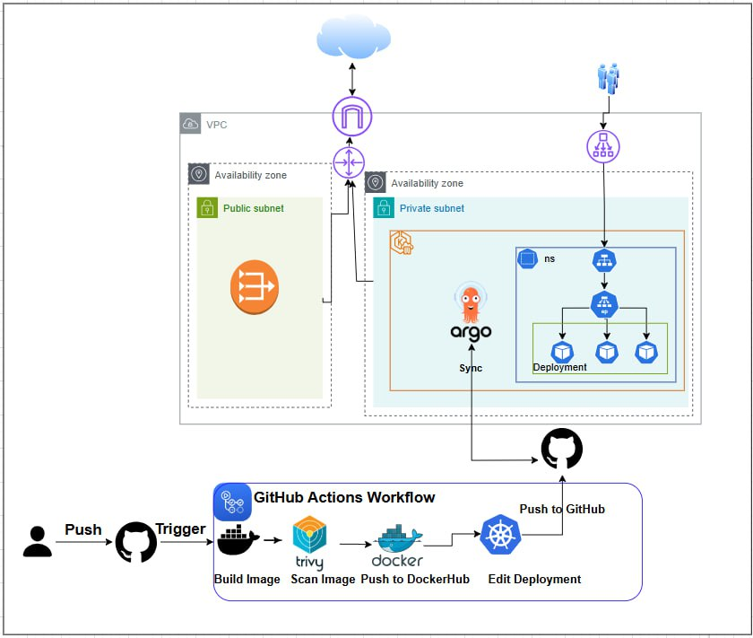
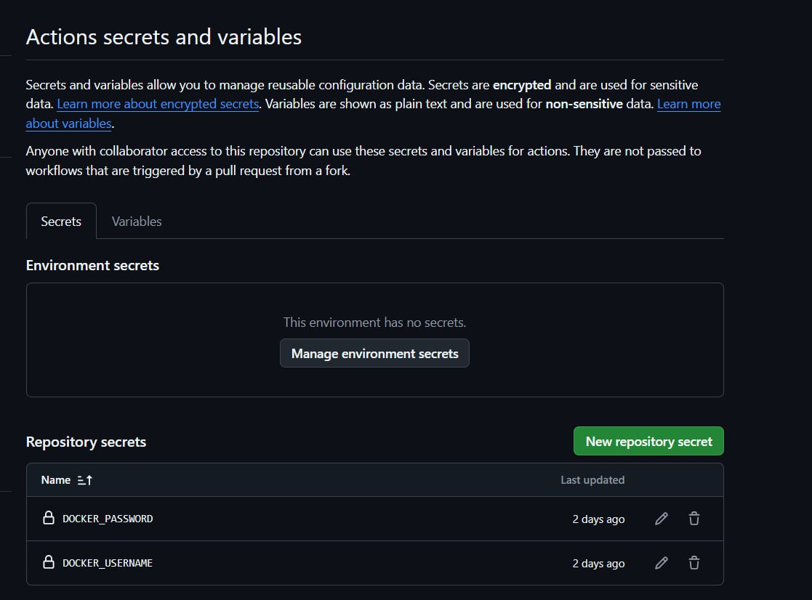

<p align="center">
  
  &nbsp;&nbsp;&nbsp;&nbsp;
  
</p>

<h1 align="center" style="font-family: 'Poppins', sans-serif; color: #e0e0e0; font-size: 2.8rem;">
   DevOps Graduation Project
</h1>

<h3 align="center" style="font-family: 'Poppins', sans-serif; color: #b0bec5;">
  In Collaboration with iVolve Technologies
</h3>

<p align="center" style="max-width: 700px; font-size: 1.1rem; color: #cfd8dc;">
  This project represents the culmination of the DevOps training at the National Telecommunication Institute (NTI),
  in partnership with iVolve Technologies. 
</p>

---
# ArgoCD GitOps Deployment on AWS EKS Using GitHub Actions & DockerHub

This project demonstrates a full GitOps CI/CD pipeline using:

AWS VPC + Public/Private Subnets

Amazon EKS (Kubernetes)

AWS Load Balancer

ArgoCD for GitOps

GitHub Actions for CI/CD

DockerHub for Image Storage

The workflow automatically builds Docker images, pushes them to DockerHub, updates Kubernetes manifests, and ArgoCD syncs and deploys the new version into the EKS cluster.

## 📌 Architecture Overview

The following diagram illustrates the full setup:



Components Explained

- VPC contains both public and private subnets.

Public Subnet hosts the NAT Gateway.

Private Subnet contains:

EKS cluster

ArgoCD (running inside the cluster)

Application namespace & deployments

- GitHub Actions:

Triggered by push

Builds Docker image

Scan Docker image

Pushes image to DockerHub

Edits Kubernetes deployment YAML

Commits back to GitHub repo

- ArgoCD:

Detects Git changes

Syncs automatically

Deploys to EKS

## 🚀 CI/CD Workflow Summary

1. Developer Pushes Code

A push to the main branch triggers the GitHub Actions workflow.

2. GitHub Actions Pipeline

Steps:

Build Docker image

Scan Docker image

Push to DockerHub

Update Kubernetes deployment manifest (new image tag)

Push updated deployment file to GitHub

3. ArgoCD GitOps Sync

ArgoCD watches the repo → detects the manifest change → deploys automatically.

## 📸 Steps I Have Done 

- Setup Infrastructure with terraform
```bash
cd terraform
terraform init 
terraform apply
```
Don`t forget to import your AWS token in the terminal


After Cluster creation edit the kubeconfig to manage the eks cluster


Check Kubectl 


then you can export KUBECONFIG in your terminal with the eks kubeconfig path

- Build docker image


- Ensure Image functionality 


- Install and Apply ArgoCD inside the cluster

   - Installation

  

   - Apply yml file 

   

- In GitHub after adding the workflow you will need to add your secrets for DockerHub here



- Argocd will apply the manifest files and in the GUI of Argocd 


- To retrive Argocd initial password


  
- and the Application will appear like this


- If we update image in Github, we will note this in Argocd


- As our service is Loadbalancer

get the External-IP from this command and try it in your browser
``` bash
kubectl get svc -n ivolve ivolve-svc
```
## 📄 Conclusion

This project demonstrates a full GitOps pipeline using:

- GitHub Actions for CI

- DockerHub for image storage

- ArgoCD for CD

- Iac with terraform

- Amazon EKS for secure and scalable deployments


Every code change automatically triggers a build → push → Argo sync → deploy.
This setup ensures consistent, automated, and production-grade delivery.


